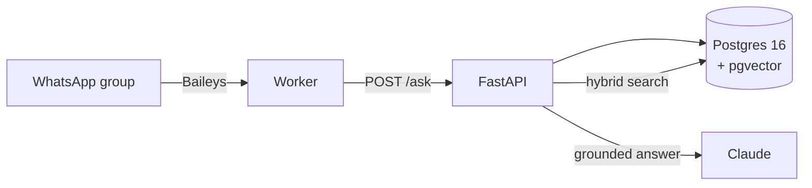

<div align="center">

# UniConnect AI

**An AI assistant for busy groups.** It reads the group's chats and call
recordings, then answers members directly — with a citation, or not at all.

[](https://github.com/Sissoko90/uniconnect-ai/actions/workflows/ci.yml)
[](https://github.com/Sissoko90/uniconnect-ai/actions/workflows/security.yml)
[](LICENSE)
[](https://www.python.org/downloads/)
[](https://github.com/astral-sh/ruff)
[](https://github.com/pgvector/pgvector)

Built for the METI UniPods AI Innovation Programme Chatbot Hackathon,
Cohort 1 · 18–24 September 2026

</div>

---

## The problem

The group has 153 members. Chat traffic is high, so people miss messages and
re-ask questions that were answered two days ago. People miss calls and never
rewatch the recording. Information gets lost between the two.

## What it does

```
Awa:  @ask where are the session recordings?

Bot:    The recordings are in the shared drive, posted by Nadia Traoré on
        18 September [1].
        — Nadia Traoré, 18 Sep 2026
```

- **Ask anything.** Answers come from the group's own history, with the
  author, the time and a link back to the original message.
- **Catch up in private.** "What did I miss since Tuesday" returns a short
  briefing, in a direct message, costing the group nothing.
- **Calls become searchable.** Recordings are transcribed and placed on the
  same timeline as the chat, so one question searches both.
- **No repeated questions.** An already-answered question returns the earlier
  answer instead of a second thread.
- **It refuses to guess.** No source found means saying so. A group
  assistant that invents a deadline once is never trusted again.

### One design rule

> **Silent in the group, talkative in private.**

In the group the bot writes only when mentioned, when a question is a
duplicate (once per topic), or for the daily digest. In a direct message it
always answers. The product solves a noise problem — it must not add to it.

## How it works



Retrieval is **hybrid**: pgvector cosine similarity finds meaning,
Postgres full text search finds the names and acronyms that embeddings
routinely miss, and the two rankings are fused. Claude then writes the answer
using nothing but the retrieved messages.

Everything runs on one VPS. Full reasoning in
**[docs/ARCHITECTURE.md](docs/ARCHITECTURE.md)**.

## Quick start

```bash
git clone https://github.com/Sissoko90/uniconnect-ai.git
cd uniconnect-ai
cp .env.example .env          # set POSTGRES_PASSWORD, and the API keys

docker compose up -d db       # database first, so schema errors surface alone
docker compose up -d --build api
curl localhost:8000/health
```

Then load a conversation and make it searchable:

```bash
python ingestion/parse_whatsapp.py "chat.txt" --group-id my-group --dry-run
python ingestion/parse_whatsapp.py "chat.txt" --group-id my-group
python ingestion/embed.py
```

Step by step, including call recordings and deployment behind nginx:
**[docs/SETUP.md](docs/SETUP.md)**.

## API

| Endpoint | Purpose |
|---|---|
| `POST /ask` | answer a question, with citations — **the frozen contract** |
| `POST /catchup` | what one member missed, and move their bookmark |
| `POST /people` | resolve a handle to a name |
| `POST /feedback` | rate the last answer a member received |
| `GET /metrics` · `/metrics/page` | usage, as JSON or as a page |
| `GET /health` | liveness, and which half of the pipeline is degraded |
| `GET /docs` | interactive browser, generated by FastAPI |

Calling these from a bot: **[docs/INTEGRATION.md](docs/INTEGRATION.md)**.

## Documentation

| | |
|---|---|
| [ARCHITECTURE](docs/ARCHITECTURE.md) | how it is built and why |
| [SETUP](docs/SETUP.md) | running it from nothing |
| [INTEGRATION](docs/INTEGRATION.md) | wiring a WhatsApp worker to the API |
| [SECURITY](SECURITY.md) | threat model, automated checks, known gaps |
| [CONTRIBUTING](CONTRIBUTING.md) | how the team works |
| [CHANGELOG](CHANGELOG.md) | what changed |

## Team

| Name | Country | Scope |
|---|---|---|
| Makan SISSOKO | 🇲🇱 Mali | Team lead, schema, ingestion, integration |
| ADEFOULOU Jediel | 🇧🇯 Benin | Retrieval engine, answer generation |
| Mbabazi Louange Liza | 🇷🇼 Rwanda | WhatsApp worker, web page |
| Sanassi Abibou DEMBÉLÉ | 🇲🇱 Mali | VPS, Docker, security |
| Steven IRINGIRA | 🇷🇼 Rwanda | Real data, group feedback, pitch |

## Privacy

This project processes the private messages of a real group. Chat exports,
`.env` and the WhatsApp session keys are never committed, phone numbers are
masked in anything the bot says publicly, and the database is reachable only
from the host it runs on. See [SECURITY.md](SECURITY.md).

## License

[MIT](LICENSE)
