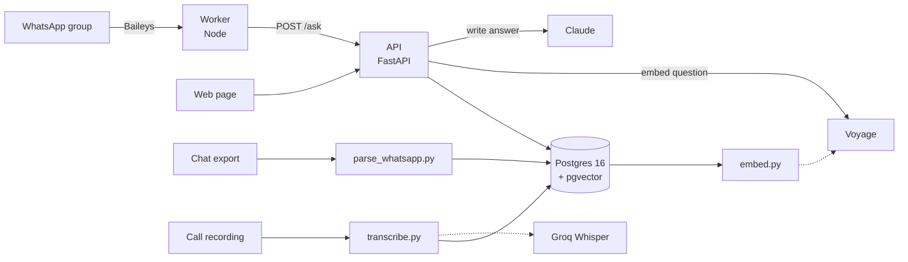

# Architecture

UniConnect AI answers questions from a WhatsApp group's own history, and
never from anything else. Every design decision below follows from that one
sentence, plus one constraint: it had to be in the group's hands within two
days of starting.

## The shape of it



Solid lines are the request path; dotted lines are the paid APIs. Everything
except the three model providers runs on one VPS.

## The four decisions that matter

### Chats and calls share one table

A chat message and fifteen seconds of a call transcript are both an
`utterance`: someone said something, at a time, in a group. Because they
share a table, one search covers both, and an answer can cite a call and a
chat in the same breath without the retrieval code knowing the difference.

The cost is that a transcript has no real author — Whisper does not label
speakers — so a transcript block is attributed to the call itself. Guessing
which member spoke would be worse than not naming one.

### Search is hybrid, not vector-only

Two searches run over every question and their rankings are fused with
reciprocal rank fusion:

| Arm | Finds | Misses |
|---|---|---|
| pgvector cosine similarity | meaning, paraphrases, questions asked in another language | exact names, acronyms, project names |
| Postgres full text (`simple`) | exact tokens: *UniPods*, *METI*, *Baileys*, a phone number | anything worded differently |

Embeddings alone fail on precisely what this group asks about — names of
people, tools and sessions. RRF is used rather than score blending because
cosine distance and `ts_rank` are not on comparable scales, and calibrating
them would be a day of work we did not have.

The full text configuration is `simple`, not `english` or `french`: the group
mixes both languages in a single thread, and a language-specific
configuration would stem one of them into nonsense.

### The answer is grounded or it is not given

Claude receives the retrieved messages, numbered, and a system prompt that
makes them the entire world. It cites by number; the API returns only the
messages that were actually cited. When retrieval returns nothing, no model
call is made at all and the bot says it could not find anything.

This is the feature. A group assistant that invents a deadline once is never
trusted again.

### Silent in the group, talkative in private

The API never decides to speak — it only answers when asked. The rule lives
in the worker: in the group it writes when mentioned, when a question is a
duplicate (once per topic), or for the daily digest. In a private chat it
always answers.

The product solves a noise problem. A bot that adds noise has failed even if
every answer is correct.

## Data model

| Table | One row is | Notes |
|---|---|---|
| `sources` | one origin: a chat export, a call, a document | one chat source per group, reused on every re-ingest |
| `utterances` | one message or one transcript block | carries `embedding vector(1024)` and a generated `fts` column |
| `answers` | every answer produced | powers duplicate detection and the metrics |
| `people` | a handle and the name behind it | resolves `+229 90 00 00 42` to a person |
| `mentions` | somebody named in a message | pending until the worker confirms it told them |
| `user_state` | a member's `last_seen_at` | the clock the catch-up feature reads |

Three details that are easy to get wrong and expensive to fix later:

- **HNSW, not ivfflat.** An ivfflat index built on an empty table has no
  centroids and stays useless however much data arrives afterwards. The
  database is created empty, so ivfflat was never an option.
- **De-duplication is `(source_id, author, said_at, md5(content))`.**
  Hashed, because a btree entry is capped near 2.7 kB and a long pasted
  message would exceed it. Re-running the parser is therefore free.
- **One chat source per group.** Otherwise each re-ingest creates a new
  source, the de-duplication index — which is scoped to a source — sees
  nothing, and the entire history is inserted again.

## The frozen contract

```
POST /ask
  → {"question": "...", "user": "...", "group_id": "..."}
  ← {"answer": "...", "sources": [{author, said_at, excerpt, permalink}], "meta": {...}}
```

Frozen on day one so that the worker, the web page and the retrieval engine
could be built in parallel by three people who were not in the same country.
`meta` was added later and is additive: anything reading `answer` and
`sources` keeps working.

The other endpoints are in [SETUP.md](SETUP.md); how to call them from the
worker is in [INTEGRATION.md](INTEGRATION.md).

## Choices we were forced into

**Baileys instead of the official WhatsApp API.** The official Groups API
caps a group at 8 participants, which makes it unusable for a group of 153.
Baileys connects as a linked device instead. The price is that the number can
be blocked by Meta if it behaves like a spammer — another reason the silence
rule is not negotiable.

**The web page is served by the API, not hosted separately.** One file, no
build step, no second deployment to keep in sync, and it calls the API on its
own origin. Vercel was the original plan; it would have added an account, a
build and a CORS configuration to the critical path for a page that is one
input box.

**Postgres for vectors instead of a vector database.** One database to
operate, one backup to take, and full text search in the same query as the
vector search. At our scale — tens of thousands of messages — a dedicated
vector store would buy nothing and cost a service to run.

**Everything on loopback.** Postgres and the API are bound to `127.0.0.1`.
Only nginx faces the internet, and only ports 22, 80 and 443 are open. The
`127.0.0.1:` prefix on the Docker port mapping is load-bearing: without it
Docker writes its own iptables rules and the database faces the internet
regardless of what ufw has been told.

## Guardrails

Four of them, and the reasoning is the same each time: 153 people, no limit
in WhatsApp, and a bot that costs about one and a half cents per question.

**Retrieved messages are untrusted input.** They are fenced in
`<group_messages>`, any closing tag inside a message is defanged so nobody
can end the block early, and the system prompt says plainly that nothing
inside can change the rules. The question is placed after the block and
labelled as the only instruction to follow. This is not hypothetical here:
the group is a cohort of an AI programme, and a public jailbreak days before
the vote would cost more than the bug.

**Private questions are scoped.** `answers.asked_privately` splits duplicate
detection in two, so a question asked in a direct message can never come back
as "this was already answered" in front of the group.

**Limits are measured in the database, not in memory.** Twenty questions per
person per hour, a daily spend cap across everybody computed from the token
counts the API actually reported, and an identical repeat from the same
person within thirty seconds answered straight from the table — which is what
makes a loop between two bots free rather than expensive.

Reaching the cap does not silence the bot. It drops to search without
generation and says so on `meta.degraded`. On the day the group votes, a
blunter answer is worth more than no answer.

**Answers that found nothing are recorded too.** Otherwise the coverage
figure is a flattering 100% — and the hourly limit could be walked straight
past by asking things that match nothing.

## What is deliberately not here

- No authentication between the worker and the API. They are on the same
  host, on loopback. Exposing the API publicly would require adding it.
- No migrations. `db/schema.sql` is applied once on a fresh volume; changing
  it today means recreating the database. That is acceptable while the data
  is disposable and stops being acceptable the moment it is not.
- No defence against a member who is simply wrong. The bot faithfully reports
  what the group said, including when the group said something incorrect.
